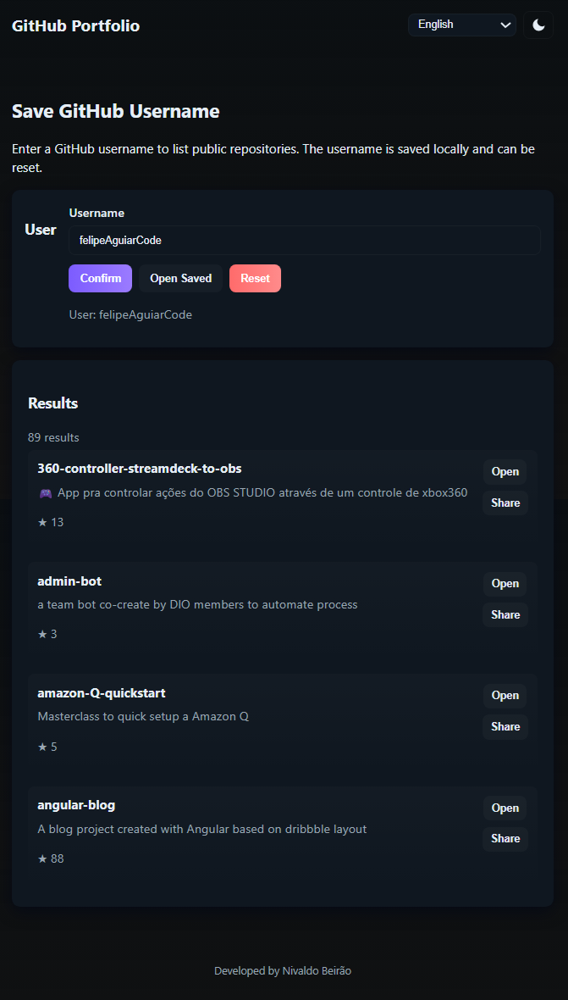

# Creating an Android App to Share Your Project Portfolio

Project developed during the Santander Bootcamp 2023 - Mobile Android with Kotlin, under the guidance of specialist [Igor Rotondo Bagliotti](https://github.com/igorbag "Igor Rotondo Bagliotti"). 
In this project, you will use the knowledge gained in this module to create a simple Android app that stores a GitHub username (entered on a start screen) and lists all their public repositories. Ensure the username is saved and that the app allows this information to be reset. Use your new technical skills to develop increasingly robust solutions and build an amazing portfolio!

## Requirements

- Android Studio Arctic Fox or newer
- Kotlin 1.9+ (adjust if your project uses a different Kotlin version)
- Minimum SDK: 21
- Internet permission (Retrofit calls to GitHub API)

## Dependencies (app/build.gradle)

- Retrofit 2.9.0
- Gson converter
- OkHttp logging interceptor
- Kotlin Coroutines
- AndroidX Lifecycle (ViewModel, LiveData)
- Material Components
- RecyclerView
- ViewBinding enabled

Example dependencies are included in the project `build.gradle` file.

## Setup and Run

1. **Clone or copy** the project into Android Studio.
2. **Sync Gradle** to download dependencies.
3. If you hit GitHub rate limits, add a personal access token:
   - Do **not** commit tokens to the repository.
   - Add the token at runtime (e.g., via a debug-only `BuildConfig` field) or use an encrypted store.
4. **Run** the app on an emulator or device with internet access.
5. In the app:
   - Enter a GitHub username and press **Confirm** to save and view repositories.
   - Use **Open Saved** to open the saved username's repo list.
   - Use **Reset** to clear the saved username.

## Notes and Tips

- **Rate limits**: Unauthenticated requests to GitHub are rate-limited. For development, use a token if you plan many requests.
- **Error handling**: Network errors are surfaced via Snackbars. Consider adding retry and offline caching for production.
- **Pagination**: The current implementation fetches all repos in a single call. For users with many repos, implement pagination with `?page=` and `?per_page=` query parameters.
- **Security**: Never store tokens in plain text or commit them. Use `EncryptedSharedPreferences` or Android Keystore for sensitive data.
- **Improvements**: Add pull-to-refresh, search/filter repos, and unit tests for repository and ViewModel layers.

[LICENSE](/LICENSE)

See [original repository](https://github.com/digitalinnovationone/desafio-github-search).
